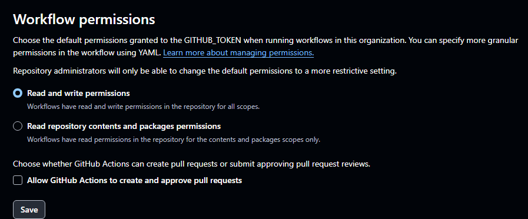

# [CI/CD] 백엔드 서버 배포 -chu

render.com에서 백엔드 서버 배포

# 1. 프로젝트 빌드

현재 Maven 기반 프로젝트이므로, mvnw를 통해 빌드

빌드 과정에서 구현된 테스트가 전부 실행 → 전부 통과되어야 빌드 성공

`mvnw.cmd package`

# 2. GitHub Push

빌드된 상태의 프로젝트를 GitHub에 push해야 함

## 주의할 점

mvnw에 실행 권한이 존재하지 않으면 permission denied당함

mvnw의 실행 권한을 변경해야 하는데, git config core.filemode가 false로 되어 있으면 명령어를 입력해도 작동 x

→ 이 아니라 윈도우 기반 쉘에서는 변경할 수 없는 것 같음. 여러 방법 해봤는데 모두 실패

- Github actions에 yml 파일 업로드해서 처리

→ .github/workflows에 fix-permission.yml 파일 생성

```yaml
name: Fix mvnw permission

on:
  workflow_dispatch:  # 수동 실행 가능하게 설정

jobs:
  fix-permission:
    runs-on: ubuntu-latest

    steps:
      - name: Checkout repo
        uses: actions/checkout@v3

      - name: Fix mvnw permission and push
        run: |
          chmod +x mvnw

          # Git 설정
          git config user.name "GitHub Actions"
          git config user.email "actions@github.com"

          # 변경이 있는 경우에만 커밋/푸시
          if ! git diff --quiet; then
            git add mvnw
            git commit -m "fix: make mvnw executable via GitHub Actions"
            git push
          else
            echo "No permission changes to commit"
          fi
```

- push하고 github의 actions에 파일이 정상적으로 잡혀있다면 파일명으로 잡혀있을 것
- run workflow해주면 됨

### organization settings

Actions → General → Workflow permissions 설정해야 함

 



# 3. Render에서 Web Service 생성

Github Repository 연동하면 됨

# 4. 설정 입력

~~나중에 변경 가능하니까 일단 기본값 사용~~

~~command만 maven 기반으로 잘 설정~~

- ~~build Command~~
    
    `~~./mvnw package -DskipTests~~`
    
- ~~Start Command~~
    
    `~~java -jar target/Dwell-In-0.0.1-SNAPSHOT.jar~~`
    

## Docker

Language로 JAVA를 잡지 못함. Docker 기반으로 올려야 함

- Language를 Docker로 설정
- root에 Dockerfile (확장자 없이)과 .dockerignore(필수 아님) 생성
- Dockerfile
    
    ```jsx
    FROM eclipse-temurin:17-jdk
    
    WORKDIR /app
    
    COPY . .
    
    RUN ./mvnw package -DskipTests
    
    CMD ["java", "-jar", "target/Home_Spring_Gwangju_04___-0.0.1-SNAPSHOT.jar"]
    ```
    
- .dockerignore
    
    ```jsx
    target/
    .git
    .gitignore
    README.md
    ```
    

# 5. 프로젝트

연결된 repository가 commit되면 자동 빌드됨 

- 로컬 DB를 잡지 못하므로 DB도 클라우드 DB에 올려야 함

## 클라우드 DB 연결

**GCP 사용**

[https://cloud.google.com/free/?utm_source=google&utm_medium=cpc&utm_campaign=japac-KR-all-ko-dr-BKWS-all-cloud-trial-PHR-dr-1605216&utm_content=text-ad-none-none-DEV_c-CRE_631263387343-ADGP_Hybrid+|+BKWS+-+BRO+|+Txt+-GCP-General-google+cloud-main-KWID_43700076506848169-kwd-389816976366&userloc_1009871-network_g&utm_term=KW_구글클라우드&gad_source=1&gclid=Cj0KCQjw4MSzBhC8ARIsAPFOuyVTfOEZ_bB7jIhE4InSNlFRALKSxxWJ91-TIj3H5Fcs0UmHCi4wSd4aAo0dEALw_wcB&gclsrc=aw.ds&hl=ko](https://cloud.google.com/free/?utm_source=google&utm_medium=cpc&utm_campaign=japac-KR-all-ko-dr-BKWS-all-cloud-trial-PHR-dr-1605216&utm_content=text-ad-none-none-DEV_c-CRE_631263387343-ADGP_Hybrid+%7C+BKWS+-+BRO+%7C+Txt+-GCP-General-google+cloud-main-KWID_43700076506848169-kwd-389816976366&userloc_1009871-network_g&utm_term=KW_%EA%B5%AC%EA%B8%80%ED%81%B4%EB%9D%BC%EC%9A%B0%EB%93%9C&gad_source=1&gclid=Cj0KCQjw4MSzBhC8ARIsAPFOuyVTfOEZ_bB7jIhE4InSNlFRALKSxxWJ91-TIj3H5Fcs0UmHCi4wSd4aAo0dEALw_wcB&gclsrc=aw.ds&hl=ko)

1. 회원가입 → 무료 서비스 → CLOUD SQL
    
    → 무료 크레딧으로 인스턴스 받기 → MySQL
    
2. 인스턴스 생성
    
    인스턴스 정보의 비밀번호에 root 비밀번호만 설정
    
    나머지는 가격 최대한 낮추는 설정으로
    
    - 저장용량 증가 자동 설정 해제
3. 네트워크 설정
    
    연결 → 네트워킹 → 새 네트워크에서 공개 IP 선택, 새 네트워크 추가
    
    0.0.0.0/0은 ip 제한이 없다는 뜻
    
    
    
4. DB 연결
    - DBeaver 사용
        
        [https://dbeaver.io/download/](https://dbeaver.io/download/)
        
    - 새로운 연결 생성
        
        
        
        
        
    
    Cloud SQL의 ip 주소와 연결할 DB 이름을 작성하고 연결
    
    → 클라우드 DB의 데이터 조회 가능
    
5. 데이터 입력
    
    Cloud Storage에 Bucket 생성, 파일 업로드
    
    
    
    Cloud SQL에서 가져오기 → 버킷 선택 → 파일 가져오기
    가져오면서 자동으로 SQL이 실행됨
    
    
    
6. 프로젝트와 연결
    
    이때 원격 저장소의 파일은 수정도 어렵고, 작업 속도도 느리기 때문에 로컬에서 작업할 때는 여전히 [localhost](http://localhost) 서버로 작업할 수 있도록 설정
    
    - application.property에 아래 속성 추가
    `spring.profiles.active=local`
        
        → 자동으로 apllication-local.properties를 찾아 설정을 읽음
        
        로컬에서 사용할 설정들을 application-local.properties에 넣어두면 됨
        
        ```jsx
        # 로컬 DB
        spring.datasource.url=jdbc:mysql://localhost:3306/ssafyhome?serverTimezone=UTC
        spring.datasource.driver-class-name=com.mysql.cj.jdbc.Driver
        spring.datasource.username=ssafy
        spring.datasource.password=ssafy
        spring.datasource.hikari.minimum-idle=3
        spring.datasource.hikari.maximum-pool-size=5
        spring.datasource.hikari.connection-timeout=600000
        spring.datasource.hikari.idle-timeout=300000
        
        # 서버 포트
        server.port=8081
        
        # 프론트 주소
        frontend.url=http://localhost:8080
        ```
        
    - application-local.properties에 배포 환경에서 사용할 설정 추가
        
        ```jsx
        # GCP Cloud SQL 설정
        spring.datasource.url=jdbc:mysql://34.41.94.5:3306/ssafyhome?useSSL=false&serverTimezone=Asia/Seoul
        spring.datasource.username=ssafy
        spring.datasource.password=ssafy
        spring.datasource.driver-class-name=com.mysql.cj.jdbc.Driver
        spring.datasource.hikari.minimum-idle=3
        spring.datasource.hikari.maximum-pool-size=5
        spring.datasource.hikari.connection-timeout=600000
        spring.datasource.hikari.idle-timeout=300000
        
        # 서버 포트
        server.port=8081
        
        # 임시로 8080으로 설정, 
        frontend.url=http://localhost:8080
        ```
        
        - 이후 render.com에서 환경변수 등록
            
            환경변수가 우선해서 적용됨. 값을 prod로 등록
            
        
        